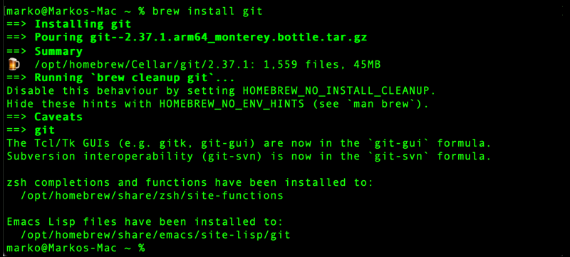
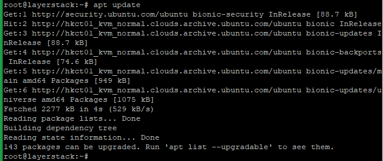
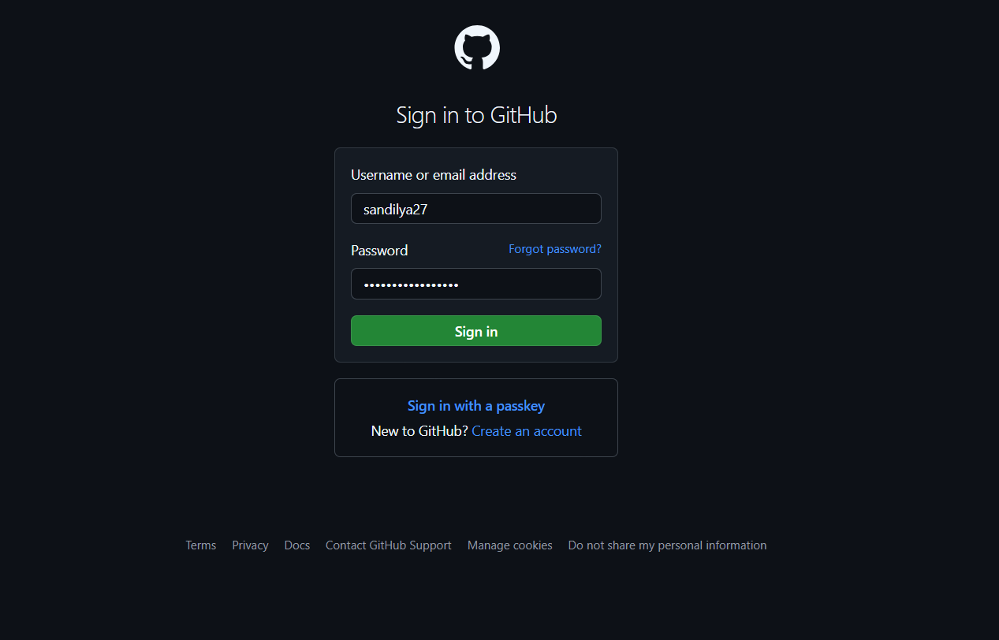
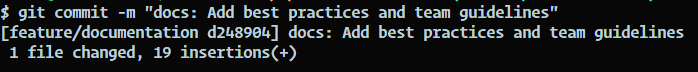

# Welcome to Git and GitHub at ChaiCode Cohort🚀

## Introduction

Welcome aboard! This guide will walk you through everything you need to know about using Git and GitHub at **ChaiCode Cohort**. As a collaborative development platform, Git helps us maintain code quality, track changes, and work together efficiently.

## Basics of Git and GitHub

### What is Git?

Git is a distributed [version control](https://en.wikipedia.org/wiki/Version_control) system that helps us track changes in our codebase. Think of it as a time machine for your code that allows you to:

- Track all changes made to your code
- Collaborate with team members without conflicts
- Maintain different versions of your project
- Recover from mistakes easily

### What is GitHub?

GitHub is a **cloud-based** platform that provides a centralized location to store, manage, and collaborate on Git repositories.

---

## Installation & Setup

### Installing Git

#### windows

1. Download Git from git-scm.com
2. Run the installer, using default settings
3. Verify installation by opening Command Prompt:

```bash
git --version
```


#### macOS

```bash
brew install git
```



#### Linux (Ubuntu/Debian)

```bash
sudo apt-get update
sudo apt-get install git
```



### Initial Configuration

Set up your identity:

```bash
git config --global user.name "Your Name"
git config --global user.email "your.email@gmail.com"
```

### GitHub Account Setup

1. Visit GitHub.com
2. Click "Sign Up"
3. Use your email address
4. Complete the verification process



---

### Cloning the ChaiCode Repository

Clone the repository:

```bash
git clone https://github.com/sandilya27/chai-code-cohort.git
```

Navigate into the cloned folder:

```bash
cd example-repo
```

---

## Essential Git Commands

### Daily Workflow Commands

- Check repository status:

```bash
git status
```

- Create a new branch:
  
```bash
git checkout -b feature/docs
```

- Stage changes:

```bash
git add .            # Add all changes
git add index.js     # Add specific file
```

- Commit changes:
  
```bash
git commit -m "feat: Add login with google"
```



- Push changes:
  
```bash
git push origin feature/docs
```

- Get latest updates:
  
```bash
git pull origin main
```

### Some Other Usefull Commands

| Commands        | Description                                 |
|:---------------:|:-------------------------------------------:|
| `git status`    | View the status of your repo                |
| `git log`       | View commit history                         |
| `git stash`     | Temporarily save uncommitted changes        |
| `git stash pop` | Apply stashed changes and remove from stash |

---

## ChaiCode Workflow

### Branch Naming Convention

- `main` - Production-ready code
- `develop` - Development branch
- `feature/` - New features (e.g. `feature/user-authentication`)
- `fix/` - Bug fixes (e.g. `fix/login-error`)
- `docs/` - Documentation updates
- `chore/` - Maintenance tasks

### Commit Message Format

```Bash
<type>: <description>

[optional body]

[optional footer]
```

### Types

- `feat`: - New features
- `fix`: - Bug fixes
- `docs`: - Documentation changes
- `style`: - Formatting changes
- `refactor`: - Code refactoring
- `test`: - Adding/modifying tests
- `chore`: - Maintenance tasks

**Examples:**

```bash
feat: Add chai customization options
fix: Resolve tea temperature calculation
docs: Update brewing instructions
```

### Pull Request Process

1. Create a new branch from `develop`
2. Make your changes
3. Push your branch
4. Open a Pull Request on GitHub
5. Fill in the PR template:

```markdown
## Description
Brief description of changes

## Type of Change
- [ ] Bug fix
- [ ] New feature
- [ ] Documentation update

## Testing
Steps to test the changes

## Screenshots
If applicable
```

6. Request reviews from team members
7. Address review comments
8. Merge after approval

---

## Best Practices

1. Regular Updates
    - Pull from develop daily
    - Keep branches up-to-date
    - Resolve conflicts promptly
2. Code Quality
    - Write clear commit messages
    - Keep commits focused and atomic
    - Document significant changes
3. Communication
    - Comment on PRs promptly
    - Ask questions when unclear
    - Share knowledge with the team
4. Branch Management
    - Delete branches after merging
    - Keep branches focused on single features
    - Regularly clean up local branches
